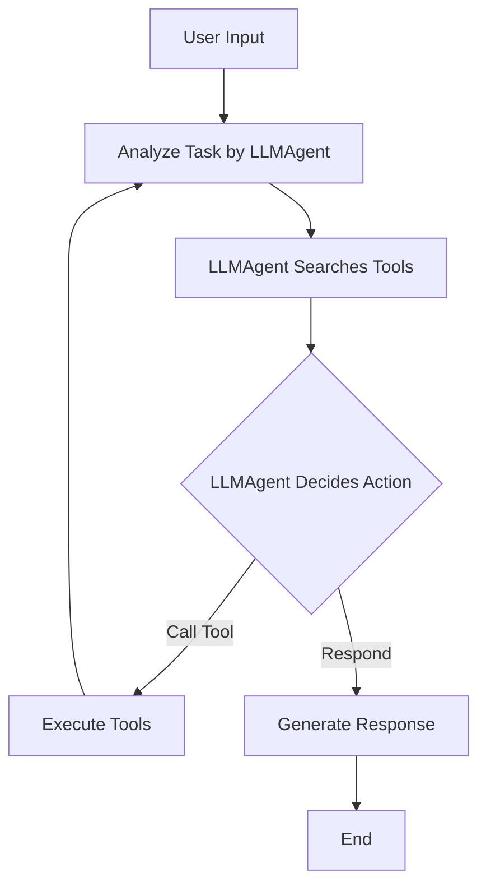

# UTCP OpenAI Agent

[](LICENSE) [](https://www.python.org/) 

A Python-based AI assistant that leverages OpenAI's GPT models with UTCP (Universal Tool Calling Protocol) integration. This agent provides a command-line interface for interacting with various tools through natural language.

## Features

- 🤖 Interactive AI assistant powered by GPT-4 family models
- 🛠️ UTCP (Universal Tool Calling Protocol) integration for tool access
- 🔧 Extensible tool system — add or map UTCP tools into the agent
- 🌍 Environment variable support through dotenv
- 💬 Simple command-line interface for quick interactions

## Prerequisites

- Python 3.8+
- OpenAI API access (API key set in `.env`)
- UTCP service configuration (see `utcp-config.json`)
- CoinGecko API access (API key set in `.env`)
- OAuth2 Call to Proprietary Private APIs require respective IdP Configurations

To generate `client.crt` and `client.key` from the .p12 Certificates, use the following command

```bash
openssl pkcs12 -in <name_of_cert>.p12 -nodes -nocerts -out client.key
openssl pkcs12 -in <name_of_cert>.p12 -clcerts -nokeys -out client.crt
openssl pkcs12 -in <name_of_cert>.p12 -cacerts -nokeys -out ca.crt
```

## Quick Start

1. Clone the repository:

```bash
git clone https://github.com/debasisdev/utcp-openai-agent.git
cd utcp-openai-agent
```

2. Install dependencies:

```bash
python -m venv venv
source venv/bin/activate
pip install -r requirements.txt
```
For Proxy and SSL problems, run `pip install pip-system-certs`.

3. Copy the example environment file and update values:

```bash
cp example.env .env
# Edit .env and add OPENAI_API_KEY, COINGECKO_API_KEY, etc.
```

4. Run the agent:

```bash
python agent.py
```

Type natural language prompts at the prompt and `exit` to quit, e.g.,

- `Serena has 23541.67 USD in her bank account. How much will it be worth in Italy?`

- `Serena is planning her holiday in Italy in July. She wants to exchange 500 American Dollars to Euros before traveling and would like to buy a gift for her friend depending on the weather. Her destination is Rome.`

- `She suddenly receives 0.45 bitcoin from a long lost lover. How much money she has now for the trip in Euros?`

- `Suggest one most recommended place to visit in Rome.`

Note: The available commands depend on your UTCP tool configuration in `utcp.json`.

## Configuration

Key configuration files:

- `utcp-config.json`: UTCP variables, variable loaders, and manual call templates
- `utcp.json`: Service catalog and tool definitions

The agent follows a structured workflow using LangGraph, a library for building stateful, multi-actor applications with LLMs.

1.  **Analyze Task**: Understands the user's query and formulates the current task.
2.  **Search Tools**: Uses UTCP to find relevant tools for the task.
3.  **Decide Action**: Determines whether to call tools or respond directly.
4.  **Execute Tools**: Calls the selected tool with appropriate arguments.
5.  **Respond**: Formats and returns the final response to the user.



## License

This project is licensed under the MIT License - see the [LICENSE](LICENSE) file for details.

## Author

[debasisdev](https://github.com/debasisdev)
